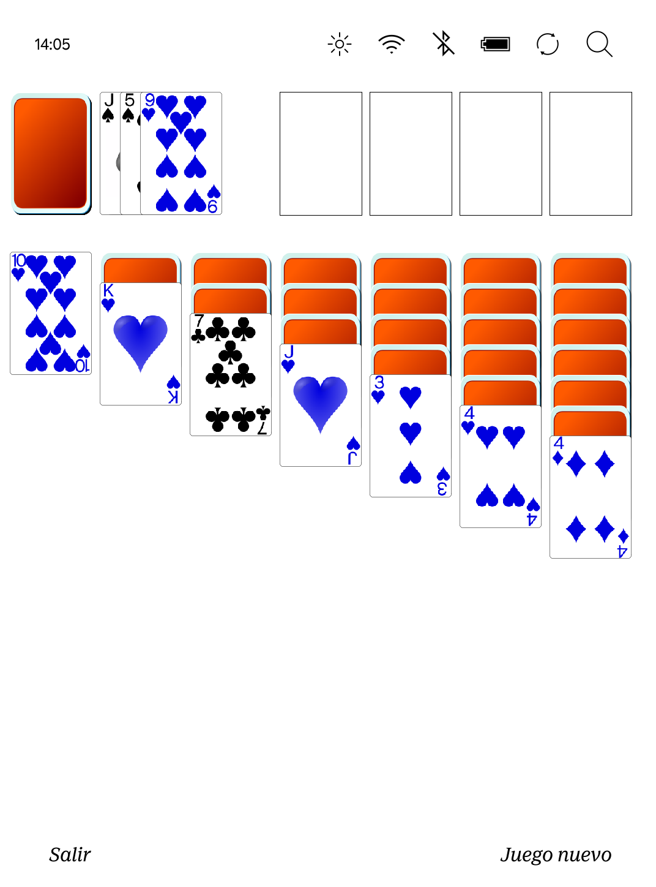

# Enable Extras (Sudoku & Solitaire) for Kobo via NickelMenu

Modern Kobo firmware still contains unused, hidden system applications for **Sudoku** and **Solitaire**. These native extras can be launched directly from the device menu without installing third-party games or running external scripts.




While these features can also be triggered using **KFmon** alongside PNG trigger files, using **NickelMenu** is the cleanest, most efficient method if you already have it installed.

---

## Configuration

Add the following lines to your NickelMenu configuration file (`/mnt/onboard/.adds/nm/games` or whatever nm file is:

```text
menu_item :main :Sudoku    :nickel_extras :sudoku
menu_item :main :Solitaire :nickel_extras :solitaire

```

---
